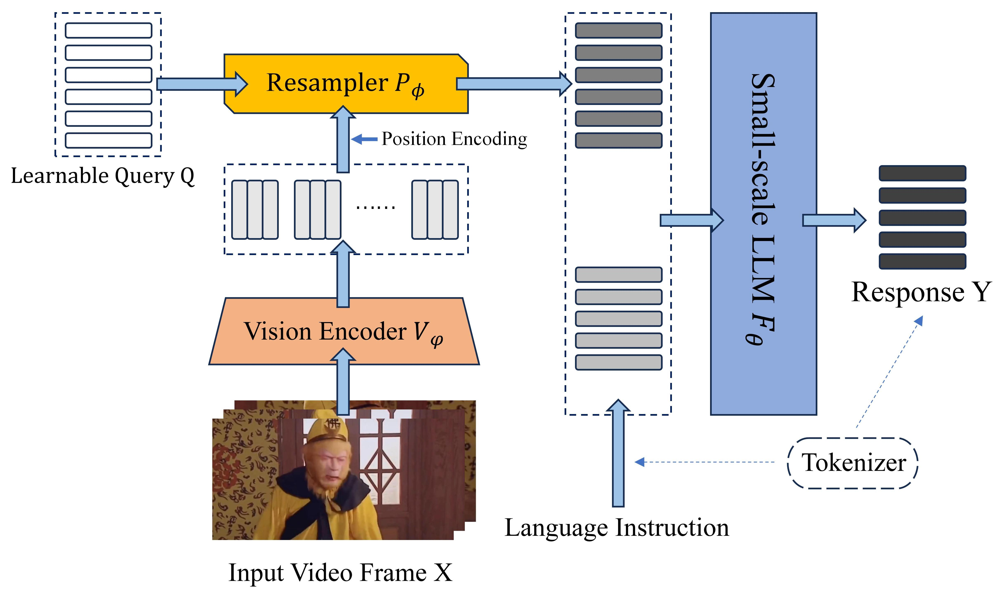

<h2 align="center">TinyLLaVA-Video</a><h5 align="center">

[](https://arxiv.org/abs/2501.15513)
[]()
[](https://github.com/ZhangXJ199/TinyLLaVA-Video/tree/main)

## 🎉 News
- [2025-04] 🔊 Our new work [TinyLLaVA-Video-R1](https://github.com/ZhangXJ199/TinyLLaVA-Video-R1) for video reasoning is released.
- [2025-01] 🎉 Our arXiv paper [TinyLLaVA-Video: A Simple Framework of Small-scale Large Multimodal Models for Video Understanding](https://arxiv.org/abs/2501.15513) is released!
- [2024-12] 🔊 Our [TinyLLaVA-Video](https://github.com/ZhangXJ199/TinyLLaVA-Video/tree/main) repository has been established.

## 📌 About
This is a framework of Small-scale Large Multimodal Models for video understanding based on [TinyLLaVA_Factory](https://github.com/TinyLLaVA/TinyLLaVA_Factory).



- The model with parameters not exceeding 4B that processes video sequences in a simple manner, without the need for complex architectures, supporting both fps sampling and uniform frame sampling.
- We validate the effectiveness of this framework through experiments, the best model achieving performance comparable to certain existing 7B models on multiple video understanding benchmarks.

## Installation and Requirements

1. Clone this repository and navigate to the folder
```bash
git clone https://github.com/ZhangXJ199/TinyLLaVA-Video.git
cd TinyLLaVA-Video
```

2. Create a conda environment, activate it and install Packages
```Shell
conda create -n tinyllava_video python=3.10 -y
conda activate tinyllava_video
pip install --upgrade pip  # enable PEP 660 support
pip install -e .
```

3. Install additional packages
```Shell
pip install flash-attn --no-build-isolation
```
##### Upgrade to the latest code base

```Shell
git pull
pip install -e .
```

## Get Started

### 1. Data Preparation

We combine partial data from two datasets: [LLaVA-Video-178K](https://huggingface.co/datasets/lmms-lab/LLaVA-Video-178K) and [
Valley](https://github.com/RupertLuo/Valley). 

|   Stage  |            Source             |    #Sample    |
|----------| :---------------------------: | :-----------: |
| Pretrain |   LLaVA-Video-178K + Valley   |     397k      |
| Finetune |       LLaVA-Video-178K        |     491k      |

#### Pretrain Data

We use four subsets of [LLaVA-Video-178K](https://huggingface.co/datasets/lmms-lab/LLaVA-Video-178K): ``0_30_s_academic_v0_1``, ``30_60_s_academic_v0_1``, ``0_30_s_youtube_v0_1``, and ``30_60_s_youtube_v0_1``, supplemented with the filtered [Video-LLaVA](https://huggingface.co/datasets/LanguageBind/Video-LLaVA). The organized pretraining annotations can be downloaded from [here](https://huggingface.co/datasets/Zhang199/TinyLLaVA-Video-v1-training-data).

#### Finetune Data

We use four subsets of [LLaVA-Video-178K](https://huggingface.co/datasets/lmms-lab/LLaVA-Video-178K): ``0_30_s_academic_v0_1``, ``30_60_s_academic_v0_1``, ``0_30_s_youtube_v0_1``, and ``30_60_s_youtube_v0_1``. The organized finetune annotations can be downloaded from [here](https://huggingface.co/datasets/Zhang199/TinyLLaVA-Video-v1-training-data).

#### Organize Data

Organize the files and annotation files as follows in ``path/to/your/dataset``:

```Shell
dataset
├── academic_source
├── liwei_youtube_videos
├── valley
├── text_files
│   ├── cleaned_video_caption.json
│   ├── cleaned_video_openqa.json
```
   

### 2. Train

You can refer to [TinyLLaVA_Factory](https://github.com/TinyLLaVA/TinyLLaVA_Factory) to modify components such as "llm," "vision_tower," and "train_recipe."

Here's an example for training a LMM using Qwen2.5.

- Replace data paths with yours in `scripts/train/qwen2/train_qwen2_base_video.sh`
- Replace `output_dir` with yours in `scripts/train/qwen2/pretrain_qwen2_video.sh`
- Replace `pretrained_model_path` and `output_dir` with yours in `scripts/train/qwen2/finetune_qwen2_video.sh`
- Adjust your GPU ids (localhost) and `per_device_train_batch_size` in `scripts/train/qwen2/pretrain_qwen2_video.sh` and `scripts/train/qwen2/finetune_qwen2_video.sh`

```bash
bash scripts/train/qwen2/train_qwen2_base_video.sh
```

Important hyperparameters used in pretraining and finetuning are provided below.

| Training Stage | Global Batch Size | Learning rate | conv_version |
| -------------- | :---------------: | :-----------: | :----------: |
| Pretraining    | 128               | 1e-4          | pretrain     |
| Finetuning     | 64                | 2e-5          | qwen2_base   |

**Tips:** 

Global Batch Size = num of GPUs * `per_device_train_batch_size` * `gradient_accumulation_steps`, we recommand you always keep global batch size and learning rate as above except for lora tuning your model.


### 3. Evaluation

We currently provide evaluations on 5 benchmarks, including [Video-MME](https://video-mme.github.io/home_page.html#leaderboard), [MVBench](https://huggingface.co/datasets/OpenGVLab/MVBench), [LongVideoBench](https://longvideobench.github.io/), [MLVU](https://github.com/JUNJIE99/MLVU), [MMVU](https://github.com/yale-nlp/MMVU).

#### Video-MME

1. Download [Video-MME](https://huggingface.co/datasets/lmms-lab/Video-MME) and put it under ``path/to/your/dataset/eval/Video-MME``.
2. Please change ``MODEL_PATH``, ``MODEL_NAME``, ``EVAL_DIR``, ``conv-mode`` and ``duration`` in ``scripts/eval/videomme.sh``. There are three types of ``duration`` available for testing: ``short``, ``medium``, and ``long``.
3. Please use the following command for single-gpu inference.
   ```bash
   CUDA_VISIBLE_DEVICES=0 bash scripts/eval/videomme.sh
   ```

#### MVBench

1. Download [MVBench](https://huggingface.co/datasets/OpenGVLab/MVBench) and put it under ``path/to/your/dataset/eval/MVBench``.
2. Please change ``MODEL_PATH``, ``MODEL_NAME``, ``EVAL_DIR`` and ``conv-mode`` in ``scripts/eval/mvbench.sh``.
3. Please use the following command for single-gpu inference.
   ```bash
   CUDA_VISIBLE_DEVICES=0 bash scripts/eval/mvbench.sh
   ```

#### LongVideoBench

1. Download [LongVideoBench](https://huggingface.co/datasets/longvideobench/LongVideoBench) and put it under ``path/to/your/dataset/eval/LongVideoBench``.
2. Please change ``MODEL_PATH``, ``MODEL_NAME``, ``EVAL_DIR`` and ``conv-mode`` in ``scripts/eval/lvbench.sh``.
3. Please use the following command for single-gpu inference.
   ```bash
   CUDA_VISIBLE_DEVICES=0 bash scripts/eval/lvbench.sh
   ```

#### MLVU

1. Download [MLVU](https://huggingface.co/datasets/MLVU/MVLU) and put it under ``path/to/your/dataset/eval/MLVU``.
2. Please change ``MODEL_PATH``, ``MODEL_NAME``, ``EVAL_DIR`` and ``conv-mode`` in ``scripts/eval/mlvu.sh``.
3. Please use the following command for single-gpu inference.
   ```bash
   CUDA_VISIBLE_DEVICES=0 bash scripts/eval/mlvu.sh
   ```

#### MMVU

1. Download [MMVU](https://huggingface.co/datasets/yale-nlp/MMVU) and put it under ``path/to/your/dataset/eval/MMVU``.
2. Please change ``MODEL_PATH``, ``MODEL_NAME``, ``EVAL_DIR`` and ``conv-mode`` in ``scripts/eval/mmvu.sh``.
3. Please use the following command for single-gpu inference.
   ```bash
   CUDA_VISIBLE_DEVICES=0 bash scripts/eval/mmvu.sh
   ```

## Model Zoo

### Trained Models 

#### Video-Level Group Resample

- [TinyLLaVA-Video-Qwen2.5-3B-Group-16-512](https://huggingface.co/Zhang199/TinyLLaVA-Video-Qwen2.5-3B-Group-16-512)
- [TinyLLaVA-Video-Qwen2.5-3B-Group-1fps-512](https://huggingface.co/Zhang199/TinyLLaVA-Video-Qwen2.5-3B-Group-1fps-512)

#### Naive Video-Level Resample
- [TinyLLaVA-Video-Phi2-Naive-16-512](https://huggingface.co/Zhang199/TinyLLaVA-Video-Phi2-Naive-16-512)
- [TinyLLaVA-Video-Qwen2.5-3B-Naive-16-512](https://huggingface.co/Zhang199/TinyLLaVA-Video-Qwen2.5-3B-Naive-16-512)

Here, 16 represents sampling 16 frames, and 512 represents using 512 tokens(queries) to represent the video sequence.

### Model Performance 
#### Video-Level Group Resample

|            VT (HF Path)           |   LLM (HF Path)   | #Frame/Query | Video-MME | MVBench | LongVideoBench |  MLVU  |  MMVU  | 
| --------------------------------- | ----------------- | ------------ | :-------: | :-----: | :------------: | :----: | :----: | 
| google/siglip-so400m-patch14-384  |  Qwen/Qwen2.5-3B  |    16/512    |    47.0   |   45.5  |      42.4      |  52.5  |  34.3  |
| google/siglip-so400m-patch14-384  |  Qwen/Qwen2.5-3B  |   1fps/512   |    47.7   |   47.0  |      42.0      |  52.6  |  36.0  |

#### Naive Video-Level Resample
|            VT (HF Path)           |   LLM (HF Path)   | #Frame/Query | Video-MME | MVBench | LongVideoBench |  MLVU  |  MMVU  | 
| --------------------------------- | ----------------- | ------------ | :-------: | :-----: | :------------: | :----: | :----: |  
| google/siglip-so400m-patch14-384  |  Qwen/Qwen2.5-3B  |    16/512    |    44.7   |   42.5  |      37.6      |  48.1  |  34.1  |
| google/siglip-so400m-patch14-384  |  microsoft/phi-2  |    16/512    |    42.7   |   42.0  |      42.2      |  46.5  |  31.6  | 

### Quick Inference Scripts

1. Please change ``model_path``, ``prompt``, ``video_file`` and ``conv-mode`` in ``eval.py``.
2.  Please use the following command for single-gpu inference.
   ```bash
   CUDA_VISIBLE_DEVICES=0 python eval.py
   ```

## &#x270F; Citation

If you find our paper and code useful in your research, please consider giving a star :star: and citation :pencil:.

```BibTeX
@article{zhang2025tinyllava,
  title={TinyLLaVA-Video: A Simple Framework of Small-scale Large Multimodal Models for Video Understanding},
  author={Zhang, Xingjian and Weng, Xi and Yue, Yihao and Fan, Zhaoxin and Wu, Wenjun and Huang, Lei},
  journal={arXiv preprint arXiv:2501.15513},
  year={2025}
}
```
```BibTeX
@article{jia2024tinyllava,
  title={TinyLLaVA Factory: A Modularized Codebase for Small-scale Large Multimodal Models},
  author={Jia, Junlong and Hu, Ying and Weng, Xi and Shi, Yiming and Li, Miao and Zhang, Xingjian and Zhou, Baichuan and Liu, Ziyu and Luo, Jie and Huang, Lei and Wu, Ji},
  journal={arXiv preprint arXiv:2405.11788},
  year={2024}
}
```

## ❤️ Community efforts
* This repository is based on [TinyLLaVA_Factory](https://github.com/TinyLLaVA/TinyLLaVA_Factory) project.
* Our codebase is built upon the [LLaVA](https://github.com/haotian-liu/LLaVA) project. Great work!
